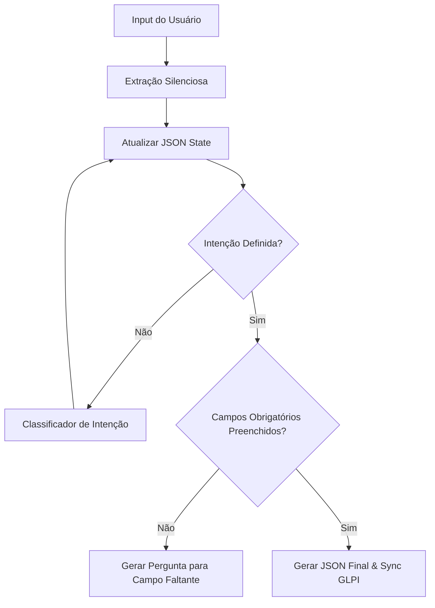

# Análise Consolidada da Documentação Técnica

> **Data da Análise:** 2025-12-19
> **Escopo:** Diretório `docs/` do projeto Ticket-Agent
> **Objetivo:** Síntese técnica profunda da arquitetura, regras de negócio e governança.

---

## 1. Visão Geral e Propósito
A documentação analisada define a estrutura de um **Agente de Triagem Local (LTA)** para suporte técnico (TI). O objetivo central é substituir interações baseadas em chat livre (suscetíveis a loops e "amnésia") por um modelo determinístico baseado em estados (**State-Driven**), garantindo consistência e minimizando a fricção com usuários leigos.

A documentação é altamente estruturada e segue um ciclo de governança estrito ("Doc-First"), onde nenhuma regra de negócio existe se não estiver formalizada no documento `01_business_rules.md`.

---

## 2. Arquitetura Técnica (State-Driven)
**Referência:** `03_technical_architecture.md`

O sistema abandona o paradigma "Chat-Driven" (onde o histórico do chat dita o fluxo) em favor de uma **Máquina de Estados Finita (FSM)**.

### 2.1. Princípios Fundamentais
1.  **Single Source of Truth (SSOT):** O estado da conversa é armazenado em um objeto JSON estruturado (`State Store`), não no texto do chat.
2.  **Silent Extraction (Extração Silenciosa):** Em cada turno, o sistema lê todo o histórico e preenche os campos do State Store silenciosamente. O agente só pergunta o que *ainda* está `null` no State.
3.  **Validação Semântica:** Uso de LLM para validar booleanos (ex: "Isso é uma descrição válida?") em vez de Regex rígido.

### 2.2. Fluxo de Processamento (Loop de Controle)


---

## 3. Regras de Negócio e Mapa de Intenções
**Referência:** `01_business_rules.md`

O sistema reconhece 5 intenções principais, cada uma com regras de inferência e exclusão rígidas.

| Intenção | Regra de Ouro | Exclusões (O que NÃO fazer) |
| :--- | :--- | :--- |
| **RESET_PASSWORD** | Assumir "Senha de Rede/AD" por padrão (99% dos casos). | Não perguntar qual sistema, a menos que especificado. |
| **CREATE_USER** | Distinção entre Efetivo (Matrícula) e Estagiário (RG). | Não pedir Data de Início ou Nível de Acesso. |
| **VPN_ACCESS** | VPN não cria usuário, apenas libera acesso a conta existente. | Não criar conta de VPN separada. |
| **EQUIPMENT_REQUEST** | Inferir "Incidente" (Quebrou) vs "Requisição" (Quero novo) pelo contexto. | Não atender equipamento pessoal. |
| **PRINTER_ISSUE** | Foco na localização física ("Perto da janela"). | **Proibido** pedir IP, Serial ou Driver. |

---

## 4. Restrições Operacionais (Constraints)
**Referência:** `02_operational_constraints.md`

Regras de segurança e usabilidade invioláveis:
*   ⛔ **Segurança:** Nunca pedir senha, IP, MAC Address, CPF ou Endereço Residencial.
*   ⛔ **Escopo:** Nunca atender equipamentos particulares (BYOD não gerenciado).
*   ⛔ **Hardware:** Nunca pedir para o usuário abrir equipamentos ou realizar diagnósticos físicos complexos.
*   ⚠️ **Incerteza:** Se não entender após 3 tentativas, acionar **Handover** (transbordo para humano).

---

## 5. Especificações Funcionais e Dados
**Referência:** `10_functional_specification.md`

### 5.1. Schemas de Saída (JSON)
O agente não executa ações diretamente no GLPI; ele produz um JSON (Artifact) que é consumido por um serviço de sincronização.

*   **Exemplo (Hardware Incident):**
    ```json
    {
      "item": "Mouse",
      "request_type": "incident",
      "description": "Botão esquerdo falhando",
      "quantity": 1
    }
    ```

### 5.2. Persona
*   **Nome:** Assistente de Triagem Local.
*   **Tom:** Cordial, direto, eficiente (L1). Evita excesso de empatia sintética.
*   **Público:** Servidores públicos leigos em TI.

---

## 6. Governança e Processos
**Referência:** `04_governance_process.md`

*   **Doc-First:** Nenhuma linha de código é escrita sem antes atualizar a documentação.
*   **RFC (Request for Comments):** Mudanças nas regras invariantes exigem aprovação formal do Arquiteto e Product Owner.
*   **Auditoria:** Código que diverge da documentação é considerado bug crítico.

---

## 7. Rastreabilidade
**Referência:** `traceability_matrix.md` e `document_inventory_matrix.md`

A documentação atual (`docs/`) é o resultado da consolidação de diversos arquivos de texto legados ("knowledge dumps"). A matriz de rastreabilidade garante que nenhum conhecimento tácito foi perdido durante a migração para a estrutura formal.

*   **Exemplo:** A regra de "não pedir IP" veio do arquivo legado `nao devemos pedir nem ip.txt` e agora reside oficialmente em `02_operational_constraints.md`.

---

## Conclusão
O projeto Ticket-Agent possui uma base documental madura que prioriza a **determinação** sobre a **probabilidade**. Ao restringir o escopo de atuação do LLM (apenas para classificação e extração, não para controle de fluxo), o sistema mitiga os riscos mais comuns de IAs generativas em suporte técnico: alucinação e loops infinitos. A implementação deve seguir rigorosamente os esquemas JSON definidos em `10_functional_specification.md` e a máquina de estados de `03_technical_architecture.md`.
