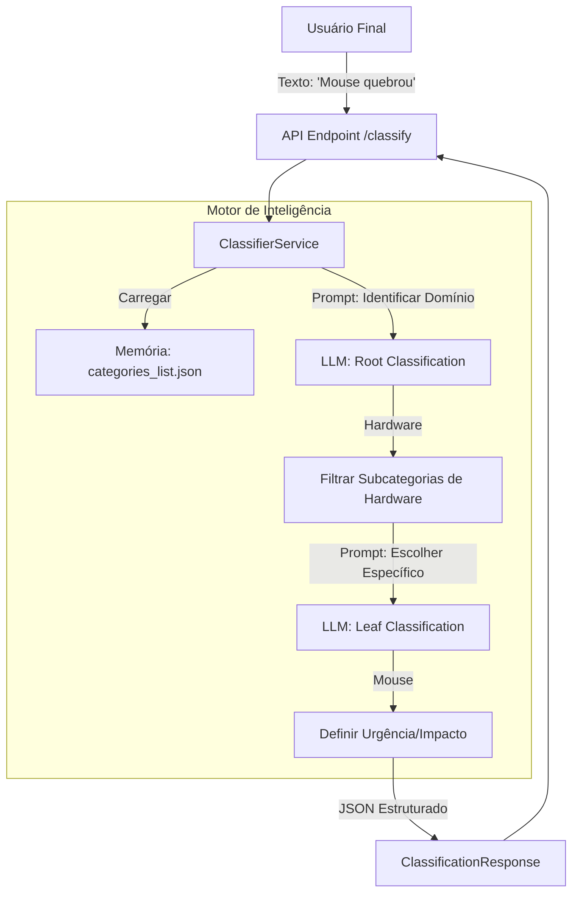

# Análise Profunda do Sistema de Inteligência Artificial (Ticket-Agent)

> **Data da Análise**: 2025-12-19
> **Escopo**: Pastas `export_inteligencia` e `api_reference`
> **Objetivo**: Estudo detalhado de arquitetura, funcionalidades e recomendações de implementação.

---

## 1. Resumo Executivo

O sistema analisado consiste em um **Agente de Triagem Inteligente para GLPI**, projetado para automatizar a classificação de chamados de suporte técnico. A arquitetura é **híbrida e stateless**, combinando árvores de decisão lógicas com o poder de interpretação semântica de Large Language Models (LLMs) locais via Ollama.

A inteligência central não reside apenas no modelo de linguagem, mas em um fluxo orquestrado de **Classificação Hierárquica em Duas Etapas (Root -> Leaf)**, que mitiga alucinações comuns em LLMs ao reduzir drasticamente o espaço de busca de categorias a cada passo.

O sistema é exposto via uma API REST (FastAPI) documentada, oferecendo endpoints tanto para classificação direta ("Fire-and-forget") quanto para triagem interativa (Chat), mantendo contratos de dados rígidos via Pydantic.

---

## 2. Arquitetura e Fluxo de Dados

A arquitetura segue o padrão de **Microserviço de Inferência**, onde a lógica de negócio (classificação) é desacoplada da aplicação principal (GLPI), comunicando-se via API.

### 2.1. Diagrama de Fluxo de Classificação

### 2.2. Componentes Principais

| Componente | Função Primária | Dependências Chave |
| :--- | :--- | :--- |
| **ClassifierService** | Orquestra a lógica de decisão e navegação na árvore de categorias. | `categories_list.json`, `LLMService` |
| **LLMService** | Abstração da comunicação com o servidor de inferência (Ollama). | `httpx`, `models/` |
| **API Endpoints** | Interface HTTP para consumo externo (`/classify`, `/chat`). | `FastAPI`, `Pydantic` |
| **Data Models** | Garante a integridade dos dados de entrada e saída. | `ClassificationRequest`, `ClassificationResponse` |

---

## 3. Taxonomia de Conceitos Chave

Com base na leitura dos arquivos, estabelece-se a seguinte taxonomia para compreensão do sistema:

1.  **Root Classification (Classificação Raiz)**: O primeiro passo da inferência. O objetivo não é acertar a categoria final, mas sim o *Domínio* macro (ex: Hardware, Software, Acesso). Isso evita que o modelo confunda "Mouse" (Hardware) com "Driver de Mouse" (Software).
2.  **Leaf Classification (Classificação Folha)**: O segundo passo, restrito apenas aos filhos do nó Raiz selecionado. É aqui que se define o ID final do GLPI.
3.  **Viability Check (Verificação de Viabilidade)**: Processo (mencionado no fluxo do Chat) onde a IA decide se *já possui informações suficientes* para abrir o chamado ou se precisa fazer mais perguntas.
4.  **Golden Dataset**: Conjunto de dados de referência (Input + Output Esperado) recomendado na estratégia de testes para validar se alterações no modelo ou código causaram regressão na precisão.
5.  **Stateless Triage**: O conceito de que a API não guarda o estado da conversa. O cliente (frontend) deve enviar todo o histórico (`messages`) a cada requisição do endpoint `/chat`.

---

## 4. Análise Funcional (Endpoints)

A documentação da API (`api_reference`) revela dois modos distintos de operação:

### 4.1. Modo Direto (`/classify`)
*   **Caso de Uso**: Formulários web, e-mails processados, integrações via webhook.
*   **Input**: Título e Descrição.
*   **Output**: Categoria final, confiança e metadados (urgência/impacto).
*   **Destaque**: Retorna `candidates` (lista de alternativas), permitindo que a interface mostre "Você quis dizer...?" se a confiança for baixa.

### 4.2. Modo Interativo (`/chat`)
*   **Caso de Uso**: Chatbots, assistentes virtuais.
*   **Comportamento Dinâmico**: A resposta pode ser do tipo `conversation` (pergunta ao usuário) ou `classification` (fim da triagem).
*   **Protocolo**: O cliente deve observar o campo `action`. Se `action="classified"`, o fluxo encerra.

---

## 5. Recomendações de Implementação

Baseado na análise crítica dos documentos (`analise_tecnica.md`, `manual_tecnico.md`), seguem as recomendações para implementação e evolução do sistema:

### 5.1. Robustez e Resiliência
*   **Abstração de Armazenamento**: A dependência direta de `categories_list.json` (sistema de arquivos) é um ponto de falha em ambientes containerizados efêmeros. **Recomendação**: Criar uma interface `CategoryRepository` que possa ler de arquivo, S3 ou Redis.
*   **JSON Repair**: O `LLMService` depende que o modelo retorne JSON válido. Modelos menores (4B/7B) falham nisso. **Recomendação**: Integrar biblioteca `json_repair` ou lógica de retry com prompt corretivo.

### 5.2. Testes e Qualidade
*   **Testes de Regressão**: A criação do `golden_dataset.json` é mandatória antes de qualquer migração de modelo. Sem isso, é impossível medir se o novo modelo (ex: Nemotron) é melhor ou pior que o antigo.
*   **Validação de Schema**: Manter o uso estrito do `Pydantic`. Isso protege o sistema de injetar dados corrompidos no GLPI.

### 5.3. Infraestrutura
*   **Timeouts Dinâmicos**: O timeout fixo de 60s pode ser insuficiente para cadeias de pensamento complexas em hardware modesto. **Recomendação**: Expor configuração de timeout via variável de ambiente.
*   **Versionamento de Categorias**: O arquivo de categorias deve ser versionado (Git ou Hash) para garantir que o backend de IA e o GLPI estejam falando a mesma língua.

---

## 6. Conclusão da Análise

O sistema apresenta uma arquitetura madura para o problema de classificação de texto, priorizando a precisão através da hierarquia (Divide & Conquer) em vez de confiar cegamente na "magia" de um único prompt gigante. A documentação é completa e cobre desde o "Hello World" até estratégias de teste avançadas.

A principal adaptação necessária para escalar este sistema é remover a dependência de arquivos locais para o carregamento de categorias e endurecer o tratamento de respostas JSON malformadas vindas de LLMs menores.
