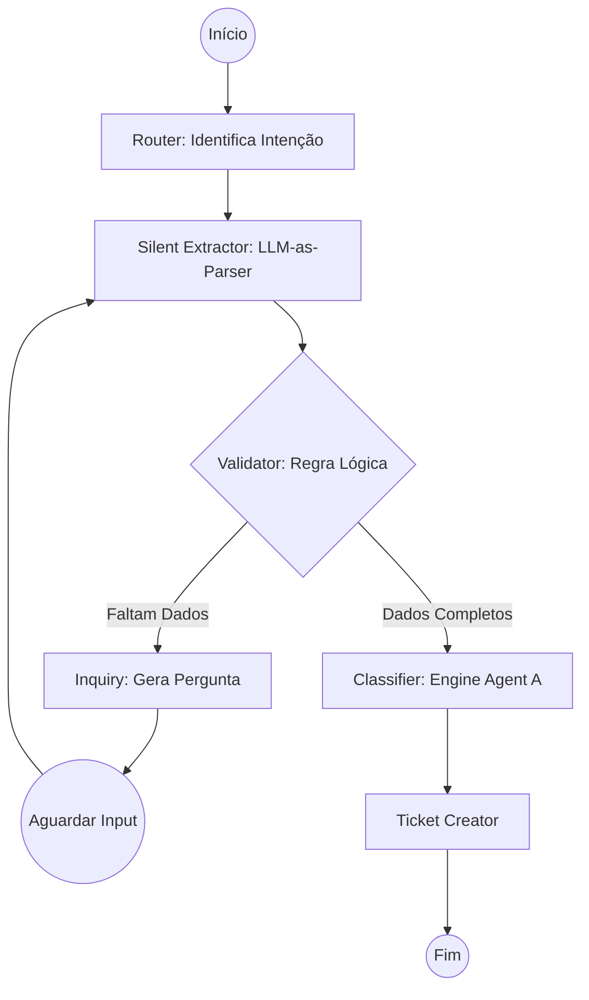

# Blueprint Técnico: Refatoração para Arquitetura State-Driven (v2.0)

**Objetivo:** Implementar a arquitetura State-Driven alinhada com a Governança v1.6 (DMD).
**Conceitos Chave:** Determinismo, Split de Intenção Semântica e Schemas Estritos.

---

## 1. Arquitetura Canônica (O FLUXO)

O novo fluxo abandona a dependência de "entendimento textual de término" pelo LLM. O controle de fluxo é movido para o Grafo (Python).

### 1.1 Grafo de Estados


### 1.2 Mudanças Específicas da v1.6
*   **RouterNode:** Não pode mais classificar `HARDWARE_ISSUE`. Deve classificar `EQUIPMENT_REQUEST`.
*   **ExtractionNode:** Para `EQUIPMENT_REQUEST`, deve extrair `request_type` (INCIDENT vs REQUISITION) baseado no contexto, sem perguntar.

---

## 2. Definição do State Schema (Pydantic)

O estado deixa de ser apenas uma lista de mensagens e torna-se um objeto estruturado.

### 2.1 Schemas de Dados Atualizados

#### `EquipmentRequestSchema` (A "Super Intenção")
```python
class RequestType(str, Enum):
    INCIDENT = "incident"       # Quebrou, não liga -> Fluxo de Reparo
    REQUISITION = "requisition" # Novo, troca, desgaste -> Fluxo de Logística

class EquipmentRequestSchema(BaseModel):
    request_type: RequestType = Field(description="Inferido pelo contexto: falha súbita vs necessidade de novo/troca")
    item_description: str = Field(description="Qual é o item (ex: mouse, monitor, notebook)")
    quantity: int = Field(default=1, description="Quantidade solicitada")
    issue_description: Optional[str] = Field(description="Obrigatório se INCIDENT: o que houve?")
    asset_id: Optional[str] = Field(description="Identificador patrimonial se disponível")
```

#### `CreateUserSchema` (Simplificado)
```python
class UserType(str, Enum):
    EFETIVO = "efetivo"
    ESTAGIARIO = "estagiario"
    TERCEIRO = "terceiro"

class CreateUserSchema(BaseModel):
    full_name: str
    user_type: UserType
    department: str
    identifier: str = Field(description="CPF, RG ou Matrícula conforme tipo")
    # Access Level, Permissions, End Date REMOVIDOS per policy
```

#### `VpnAccessSchema` (Independente)
```python
class VpnRequestType(str, Enum):
    ACCESS_GRANT = "access_grant" # Liberar grupo
    INSTALL = "install"           # Instalar software

class VpnAccessSchema(BaseModel):
    request_type: VpnRequestType
    justification: str = Field(description="Motivo do acesso")
    host_or_ip: Optional[str] = Field(description="Destino do acesso se souber")
    # User Creation Details REMOVIDOS per policy
```

### 2.2 AgentState (State Store)
```python
class AgentState(TypedDict):
    # Memória
    messages: Annotated[List[BaseMessage], operator.add]
    pinned_request: str  # A 1ª mensagem do usuário, fixa.
    
    # Estado Estruturado
    intent: Optional[str]
    data: Dict[str, Any]  # Dados já extraídos
    
    # Controle (Derivados)
    missing_fields: List[str]
    is_complete: bool
    
    # Output final
    ticket_id: Optional[int]
```

---

## 3. Especificação de Contratos de Nós

### 3.1 `extraction_node` (Silent Node)
-   **Responsabilidade:** Extrair entidades do *último input* e mesclar com `state.data`.
-   **Regra de Inferência Dupla:** Deve inferir `RequestType` (`incident` ou `requisition`) silenciosamente.
-   **LLM Role:** Puramente Parser. Retorna JSON bruto seguindo o schema da intenção.

### 3.2 `validator_node` (Logical Node - NO LLM)
-   **Responsabilidade:** Comparar `state.data` com o `RequiredFields` da intenção.
-   **Lógica:** Iterar sobre chaves obrigatórias.
-   **Regra de VPN:** Se intenção for VPN, `is_complete` é True apenas com `justification` e `request_type`.

### 3.3 `inquiry_node` (NLG Node)
-   **Responsabilidade:** Gerar a pergunta para o próximo campo em `state.missing_fields`.
-   **Prompt:** "Você é um analista de suporte. Use o contexto PINNED_REQUEST para saber que o usuário já disse 'quero VPN' e pergunte apenas a justificativa faltante."

---

## 4. Plano de Execução (Próximos Passos)

1.  **Refatorar `schemas.py`:** Implementar os novos modelos descritos acima.
2.  **Atualizar `router.py`:** Remover `HARDWARE_ISSUE` do enum e do prompt.
3.  **Atualizar `validator.py`:** Garantir que a lógica suporte campos condicionais e defaults.
4.  **Testar com Simulation:** Rodar cenários de "Impressora Informal" e "Mouse Novo".

---

**Nota:** Este documento substitui a versão v1.0 e serve como guia definitivo para o Code Mode.
