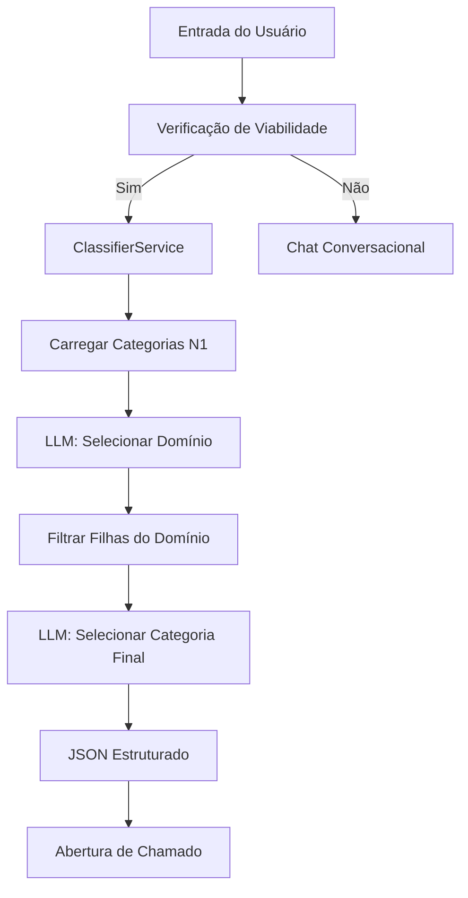

# Arquitetura Atual da Inteligência Artificial

## 1. Visão Geral
A inteligência do sistema é baseada em um modelo híbrido que combina **Classificação Hierárquica em Duas Etapas** com **Extração de Entidades via LLM**. O núcleo do processamento é stateless, mas depende de um cache local de categorias sincronizado com o GLPI.

## 2. Componentes Principais

### 2.1. LLM Service (`src/services/llm_service.py`)
- **Motor**: Ollama (Interface compatível com OpenAI/HTTPX).
- **Modelo Padrão**: Configurável via env `LLM_MODEL` (ex: `Qwen/Qwen2.5-Coder-7B`).
- **Protocolo**: HTTP POST para `/api/chat`.
- **Funcionalidades**:
    - `generate_response`: Geração simples de texto.
    - `chat_completion`: Suporte a histórico de mensagens.
    - `extract_entities`: Extração estruturada (JSON) baseada em schema.

### 2.2. Classifier Service (`src/services/classifier_service.py`)
- **Lógica de Decisão**: Árvore de Decisão Assistida por LLM.
- **Fluxo de Classificação**:
    1.  **Carregamento**: Lê `categories_list.json` para memória.
    2.  **Passo 1 (Root Classification)**:
        - Filtra categorias de Nível 1.
        - Envia prompt para LLM selecionar o "Domínio" (ex: Hardware, Acesso).
        - Saída: `root_id`.
    3.  **Passo 2 (Leaf Classification)**:
        - Filtra categorias filhas do `root_id` selecionado.
        - Envia prompt para LLM selecionar a categoria final mais específica.
        - Determina metadados: Urgência, Impacto, Tipo (Incidente/Requisição).
    4.  **Fallback**: Se o Passo 2 falhar, retorna a categoria Raiz com baixa confiança.

### 2.3. Base de Conhecimento
- **Arquivo**: `categories_list.json`
- **Origem**: Sincronização via API GLPI (`SyncService`).
- **Estrutura**: Lista plana de objetos contendo hierarquia (`Root > Child`).

### 2.4. Prompts (`src/config/prompts.json`)
- Armazena templates para tarefas auxiliares como:
    - `intent_classification`: Classificação de intenção rápida (Access, Hardware, etc).
    - `ticket_viability_check`: Validação se há informações suficientes para abrir chamado.

## 3. Fluxo de Dados

## 4. Interfaces e Contratos

### Entrada (`ClassificationRequest`)
- `description`: Texto do usuário.
- `title`: Título opcional.

### Saída (`ClassificationResponse`)
- `selected_category_id`: ID GLPI.
- `confidence`: 0.0 a 1.0.
- `ticket_type`: 1 (Incidente) ou 2 (Requisição).
- `urgency/impact`: 1 a 5.
- `reasoning`: Explicação da IA para a escolha.
