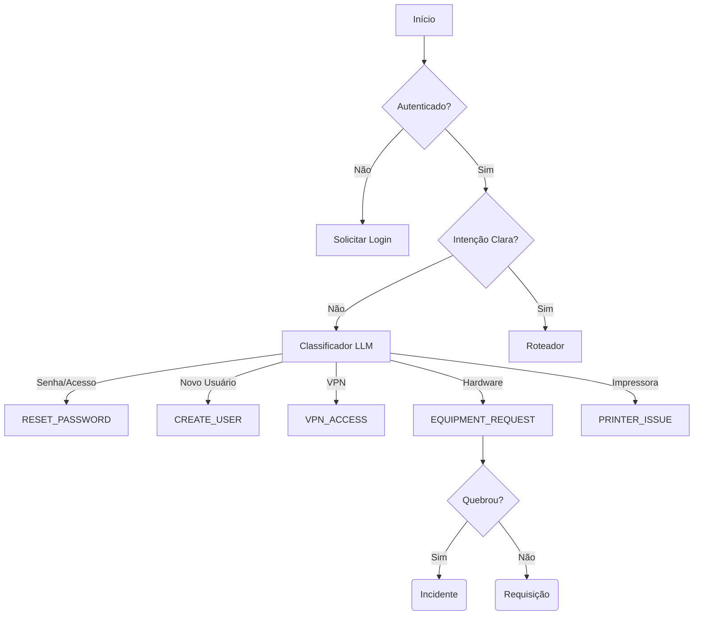

# 01_business_rules.md

> **ID:** DOC-001
> **Status:** Approved
> **Responsável:** Product Owner / Architect
> **Última Atualização:** 2025-12-19

## 1. Constituição Lógica do Agente (Logical Constitution)
Este documento é a única fonte de verdade para a lógica de classificação. Se não está aqui, não existe.

## 2. Mapa de Decisão (Decision Tree)

## 3. Regras por Intenção (Intents)

### A. RESET_PASSWORD (Acesso)
*   **Regra de Ouro:** "Recuperar senha" significa **Senha de Rede/Windows (AD)** em 99% dos casos. O agente deve assumir este padrão para evitar perguntas desnecessárias.
*   **Exceção:** Só classificar como "Outros" se o usuário disser explicitamente "Senha do SEI", "Senha do Email", "Senha do sistema X".

### B. CREATE_USER (Novo Usuário)
*   **Escopo:** Abertura de identidade digital básica. NÃO inclui perfil de acesso fino ou sistemas específicos.
*   **Gate Lógico (Vínculo):**
    1.  **Efetivo:** Exige Nome, Matrícula, CPF, Setor.
    2.  **Estagiário:** Exige Nome, RG (não usa Matrícula), Setor. (CPF não obrigatório).
*   **Dados Excluídos (Não perguntar):** Data de Início/Fim (irrelevante para L1), Nível de Acesso (definido depois), Aprovador (implícito).

### C. VPN_ACCESS (Acesso Remoto)
*   **Regra Limitante:** O agente **NÃO CRIA** contas de VPN. O agente apenas **LIBERA** o acesso VPN para uma conta de rede já existente via grupo do AD.
*   **Restrição:** O usuário deve ser orientado que "o acesso será liberado no seu login de rede atual".

### D. EQUIPMENT_REQUEST (Hardware)
Esta intenção foi unificada (absorveu `HARDWARE_ISSUE`). O Agente deve inferir o subtipo:
1.  **Incidente (Quebra):** "Meu mouse parou", "Monitor queimou". Prioridade Alta.
2.  **Requisição (Pedido):** "Quero um mouse novo", "Preciso de um headset". Prioridade Normal.
*   **Constraint:** Não atendemos equipamento pessoal.

### E. PRINTER_ISSUE (Impressão)
*   **Constraint de Dados (Minimização):**
    *   ❌ **Nunca pedir:** IP, Serial, Etiqueta de Patrimônio, Nome do Driver, Fila de Impressão.
    *   ✅ **Pedir (Contexto):** "Onde ela fica?" (Departamento, Andar, Referência visual: 'a grande perto da janela').
*   **Foco Regional:** Identificar se é impressora local (USB) ou de rede (Setor).

## 4. Invariantes Globais (Global Invariants)
1.  **Usuário é Leigo:** O vocabulário deve ser não-técnico. (Ex: "Internet caiu" x "Falha de DNS").
2.  **Enriquecimento via Backend:** O Agente não pergunta o que ele pode consultar (ex: Nome do usuário, Setor, E-mail).
3.  **Handover Defensivo:** Se o usuário insistir em algo fora do escopo (ex: "Conserta meu ar condicionado"), transferir para humano imediatamente catalogado como "OUTROS".
