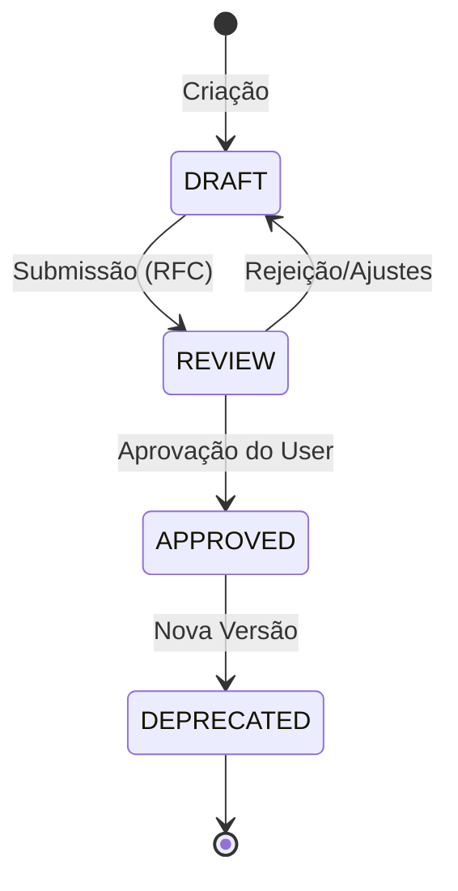

# 04_governance_process.md

> **ID:** DOC-004
> **Status:** Draft
> **Responsável:** Analista de Governança
> **Última Atualização:** 2025-12-19

## 1. Ciclo de Vida da Documentação
Para garantir a integridade do sistema, a documentação segue um ciclo rígido de aprovação. Nada é implementado sem antes estar documentado e aprovado ("Doc-First").

### Estados do Documento

1.  **DRAFT (Rascunho):** Em elaboração. Não válido para implementação.
2.  **REVIEW (Em Revisão):** Submetido para aprovação técnica e de negócio.
3.  **APPROVED (Aprovado):** Versão oficial. Válido para implementação.
4.  **DEPRECATED (Obsoleto):** Substituído por versão mais nova. Mantido para histórico.

## 2. Processo de RFC (Request for Comments)
Alterações nas "Regras Invariantes" (`DOC-001`, `DOC-002`) exigem um processo formal.

### Fluxo de Aprovação
1.  **Abertura:** Criar RFC descrevendo: "Problema", "Proposta de Mudança" e "Impacto no Legacy".
2.  **Análise de Impacto:** O Arquiteto avalia se a mudança quebra o modelo State-Driven.
3.  **Aprovação:** O "Dono do Produto" (User) aprova.
4.  **Merge:** O documento oficial é atualizado e a versão incrementada (ex: 1.0 -> 1.1).

## 3. Critérios de Qualidade (Checklist)
Antes de aprovar qualquer documento, verificar:
*   [ ] Segue o padrão `snake_case` e template oficial?
*   [ ] Os termos usados constam no Glossário?
*   [ ] Há conflito com regras anteriores? (Ex: Pedir IP em uma nova intenção viola `DOC-002`).
*   [ ] A linguagem é adequada para a persona definida?

## 4. Manutenção Contínua
*   A cada *Sprint* ou *Ciclo de Desenvolvimento*, a documentação deve ser auditada.
*   Código que diverge da documentação é considerado **Bug Crítico**, devendo a documentação ser corrigida (se o código estiver certo e a doc desatualizada) ou o código revertido (se violar a regra aprovada).
