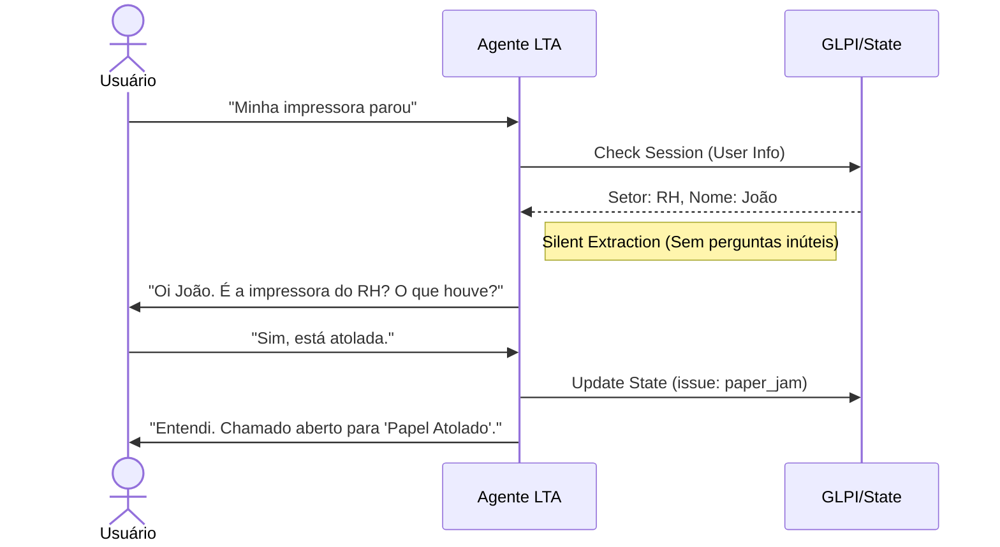

# 10_functional_specification.md

> **ID:** DOC-010
> **Status:** Draft
> **Responsável:** Designer de Produto / Documentador
> **Última Atualização:** 2025-12-19

## 1. Visão Narrativa (O "Espírito" do Sistema)
Este documento traduz as Regras de Negócio (`DOC-001`) em uma experiência de uso humana. Ele preserva o contexto operacional real descrito nos documentos históricos.

### O Cenário
Estamos em um órgão público. O usuário é um servidor que precisa trabalhar, não um técnico de TI. Ele não quer abrir um "ticket", ele quer resolver um problema.
*   **O Problema:** O usuário diz "A impressora do RH parou".
*   **A Falha Antiga:** O bot perguntava "Qual o IP?". O usuário desistia ou digitava "não sei", gerando um ticket inútil.
*   **A Solução LTA:** O bot responde "Entendi, é a impressora do setor RH. O que está acontecendo? (ex: papel atolado, sem toner)".

### 3.2. Data Schemas (JSON Output)
The agent must output a structured JSON object. The strict schemas for `ticket_payload` are defined below.

#### A. `RESET_PASSWORD`
```json
{
  "usuario_rede": "jose.silva", // Inferred from context if not provided
  "sistema_afetado": "Rede/Windows" // Default unless valid exception
}
```

#### B. `CREATE_USER`
```json
{
  "nome_completo": "Maria Oliveira",
  "setor": "Contabilidade",
  "tipo_usuario": "ESTAGIARIO", // [EFETIVO, ESTAGIARIO]
  "rg": "1234567890", // Required if ESTAGIARIO
  "cpf": null // Required if EFETIVO
}
```

#### C. `EQUIPMENT_REQUEST`
```json
{
  "item": "Mouse",
  "request_type": "incident", // [incident, requisition]
  "description": "O botão esquerdo parou de funcionar", // Required if incident
  "quantity": 1 // Default=1
}
```

#### D. `PRINTER_ISSUE`
```json
{
  "location_description": "Impressora do RH, 2º andar",
  "issue_summary": "Atolamento de papel"
}
```

### 3.3. Inference Rules Table
| Trigger | Inferred Value | Rule Type |
| :--- | :--- | :--- |
| "Week dates" (e.g., "next mon") | Convert to `YYYY-MM-DD` | Soft Logic |
| "Velho", "Gasto", "Novo" | `request_type: requisition` | Semantic |
| "Quebrou", "Parou", "Não liga" | `request_type: incident` | Semantic |
| Pronouns ("it", "ela") | Bind to previous object | Contextual |

## 2. Jornadas do Usuário (User Stories)

### Jornada A: O Esquecido (Reset de Senha)
> **Contexto:** Segunda-feira de manhã. Usuário bloqueou a conta.
1.  **Usuário:** "Não consigo entrar no computador."
2.  **Agente (Pensamento):** "Entrar no computador" = Login de Rede. Não preciso perguntar qual sistema.
3.  **Agente (Ação):** Verifica se o ID do usuário já veio na sessão. Se não, pergunta: "Pode me informar seu usuário de rede ou matrícula?"
4.  **Usuário:** "é o joao.silva"
5.  **Agente:** "Certo. Vou abrir um chamado para resetar sua senha de rede. Um técnico entrará em contato em breve." (Fim)

### Jornada B: O "Meu Mouse Quebrou" (Incidente)
1.  **Usuário:** "Meu mouse parou de funcionar do nada."
2.  **Agente (Pensamento):** "Parou de funcionar" = Incidente. Item = Mouse.
3.  **Agente (Ação):** Confirma e encerra.
4.  **Agente:** "Entendido. Vou registrar o incidente com seu mouse para a equipe de suporte local."

### Jornada C: O "Quero um Mouse Melhor" (Requisição)
1.  **Usuário:** "O meu mouse está muito velho, a rodinha falha. Queria um novo."
2.  **Agente (Pensamento):** "Velho/Queria um novo" = Requisição (Substituição por desgaste).
3.  **Agente (Ação):** Registra sem burocracia.
4.  **Agente:** "Sem problemas. Registrei a solicitação de troca do mouse por desgaste."

## 3. Fluxo de Interação Ideal



## 4. Protocolos de Diálogo (Tone of Voice)

### O que dizer vs O que NÃO dizer

| Situação | ❌ Jeito Robótico (Proibido) | ✅ Jeito LTA (Obrigatório) |
| :--- | :--- | :--- |
| **Início** | "Olá. Informe sua intenção." | "Olá! Como posso ajudar você hoje?" |
| **Dúvida** | "Intenção não reconhecida. Tente novamente." | "Não entendi bem. Você está com problemas de acesso, impressora ou precisa de algum equipamento?" |
| **Erro** | "Erro: Falta campo 'description'." | "Preciso que você me dê um breve detalhe do que aconteceu para o técnico saber o que levar." |
| **Hardware** | "Informe o Patrimônio do Ativo." | "É o equipamento que você está usando agora?" |

## 4. O Fluxo de "Salvação" (Handover)
Se o agente não entender após 3 tentativas, ele não deve culpar o usuário.
*   **Fraseologia:** "Desculpe, ainda não consegui entender exatamente. Para não tomarmos mais tempo, vou passar seu caso para um analista humano que vai te ajudar melhor."
