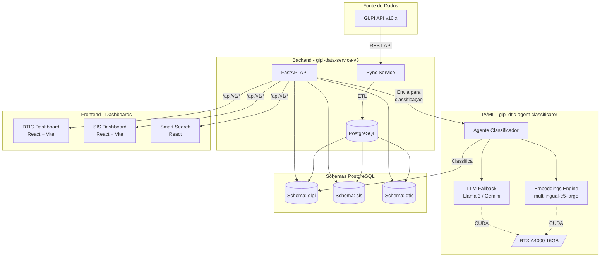

# Visão Geral da Arquitetura - BD_Cau_V2

**Versão**: 1.0  
**Última Atualização**: 2025-12-06

---

## Diagrama de Arquitetura



---

## Componentes Principais

### 1. GLPI API (Fonte Externe)
- **Versão**: 10.x
- **Protocolo**: REST + Session Tokens
- **Recursos Consumidos**:
  - Tickets (`/Ticket`)
  - Usuários (`/User`)
  - Grupos (`/Group`)
  - Categorias (`/ITILCategory`)

### 2. glpi-data-service-v3 (Backend)
**Stack**: FastAPI + SQLAlchemy + PostgreSQL

**Responsabilidades**:
- Sincronizar dados GLPI → PostgreSQL local
- Servir APIs REST para frontends
- Coordenar com agente de classificação
- Gerenciar schemas múltiplos (glpi, sis, dtic)

**Porta**: 8000

### 3. glpi-dtic-agent-classificator (IA)
**Arquitetura**: Híbrida (Embeddings + LLM)

**Pipeline**:
1. **Texto do Ticket** → Embeddings (multilingual-e5-large)
2. **Similaridade de Cosseno** com Golden Tickets
3. **Se confiança >= 0.75**: Categoria definida
4. **Se confiança < 0.75**: Chamar LLM (Llama 3 / Gemini)
5. **Se confiança < 0.50**: Human Review Required

**GPU**: RTX A4000 16GB (CUDA)

### 4. Dashboards (Frontend)
**Stack**: React 18 + Vite + TypeScript

**DTIC Dashboard**:
- Métricas gerais
- Tickets por status
- Atividades recentes

**SIS Dashboard**:
- Métricas específicas SIS
- Carregadores

**Smart Search**:
- Busca semântica em tickets

---

## Fluxo de Dados

### Sincronização GLPI
```
GLPI API → Sync Service → PostgreSQL (schema glpi)
```

### Classificação de Tickets
```
Ticket novo → API → Agente → Embeddings (GPU)
                            ↓ (se baixa confiança)
                            LLM (GPU) → Categoria
```

### Visualização
```
PostgreSQL → API → React Dashboard → Usuário
```

---

## Schemas PostgreSQL

### glpi
Dados sincronizados do GLPI:
- `tickets`
- `users`
- `groups`
- `categories`
- `ticket_changes`

### sis
Dados específicos do departamento SIS:
- `sis_users`
- `sis_groups_users`
- `sis_metrics`

### dtic
Dados específicos do departamento DTIC:
- `dtic_users`
- `dtic_profiles`
- `dtic_metrics`

---

## Tecnologias

| Camada | Tecnologia | Versão |
|--------|------------|--------|
| **API** | FastAPI | 0.104+ |
| **ORM** | SQLAlchemy | 2.0+ |
| **DB** | PostgreSQL | 14+ |
| **Frontend** | React | 18.x |
| **Build** | Vite | 5.x |
| **Linguagem Frontend** | TypeScript | 5.x |
| **Embeddings** | sentence-transformers | 2.2+ |
| **LLM Local** | Ollama (Llama 3) | - |
| **LLM Cloud** | Gemini API | - |
| **GPU** | NVIDIA RTX A4000 | 16GB VRAM |

---

## Decisões Arquiteturais

Ver `docs/architecture/decisions/` para ADRs completos:

- **ADR-001**: Arquitetura Híbrida (Embeddings + LLM)
- **ADR-002**: (A CRIAR) Monorepo vs Multi-repo
- **ADR-003**: (A CRIAR) PostgreSQL Schemas Strategy

---

## Escalabilidade

### Atual (Single Server)
- **Backend**: 1 instância FastAPI
- **Frontend**: Static build servido por nginx
- **GPU**: RTX A4000 local
- **DB**: PostgreSQL local

### Futuro (Se Necessário)
- **Backend**: Load balancer + múltiplas instâncias
- **GPU**: Pool de GPUs (NVIDIA NIM)
- **DB**: Replicas read-only
- **Cache**: Redis para queries frequentes

---

## Segurança

- **API**: JWT tokens
- **DB**: Credenciais em `.env`
- **Frontend**: Variáveis ambiente para API URL
- **GLPI**: Session tokens (renovação automática)

---

**Ver Também**:
- `01_data_flow.md` - Fluxo detalhado de dados
- `02_agent_pipeline.md` - Pipeline de classificação IA
- `03_gpu_setup.md` - Setup GPU / Ollama
